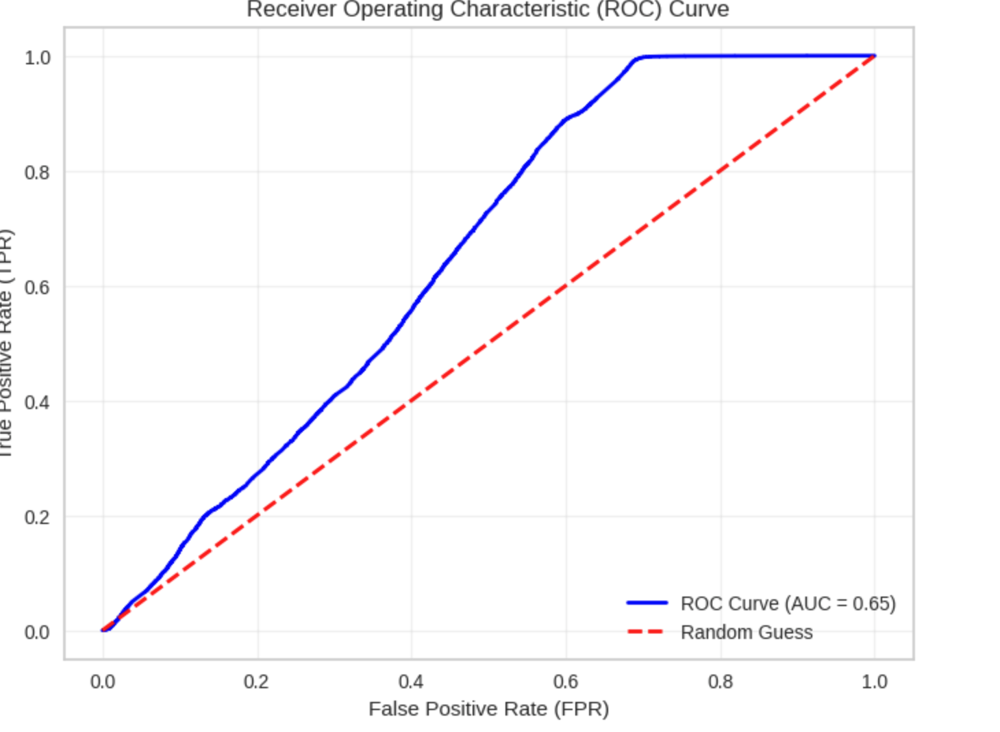

# CIFAR_MIA
Membership Inference Attacks on CIFAR 10 dataset.

This is a new approach to Membership Inference attacks using the shadow model approach as presented in the paper[Membership Inference Attacks Against Machine Learning Models](https://ieeexplore.ieee.org/document/7958568) by Shokri et al.

## What did I do?
1. I followed the architecture mentioned in the paper and trained the model on the orginal [CIFAR dataset](https://www.cs.toronto.edu/~kriz/cifar.html) and evaluated it on the orginal test dataset of CIFAR 10.
2. I then used the [CIFAKE](https://www.kaggle.com/datasets/birdy654/cifake-real-and-ai-generated-synthetic-images) dataset to train 5 shadow models that have the same architecture of the target model.
3. I then generated attack data for the Attack model using the following method. I took the test subsection of the CIFAKE dataset divided into 5 equal parts creating 5 dataloader.
4. For each shadow model I then obtained the last layer softmax predictions or "logits" and stored them as the feature vectors for the attack model and assigned a label of 1 for the logits for the examples from the training dataset of the shadow models and a label 0 for the logits for the examples from one of the splits of the testdataset of the shadow model.
5. Now the attack model is then trained on this generated dataset and using pycaret I found out that a Extra Trees Classifier performed well.
6. I then evaluated the efficacy of the MIA and the metrics are presented below.

### Attack Model Performance Metrics

| Metric        | Value       |
|---------------|-------------|
| **Precision** | 0.8763      |
| **Recall**    | 0.9979      |
| **F1 Score**  | 0.9332      |
| **Accuracy**  | 0.8809      |
| **AUC Score** | 0.6484      |

### ROC_Curve for Membership Inference Attacks

## Threat model

We assume that the attacker has access to the follwing parameters
1. The outputs of the final layer of the target model.
2. The architecture of the target model.
3. The attacker generates a synthetic dataset (CIFAKE) and uses this dataset to train shadow models.

